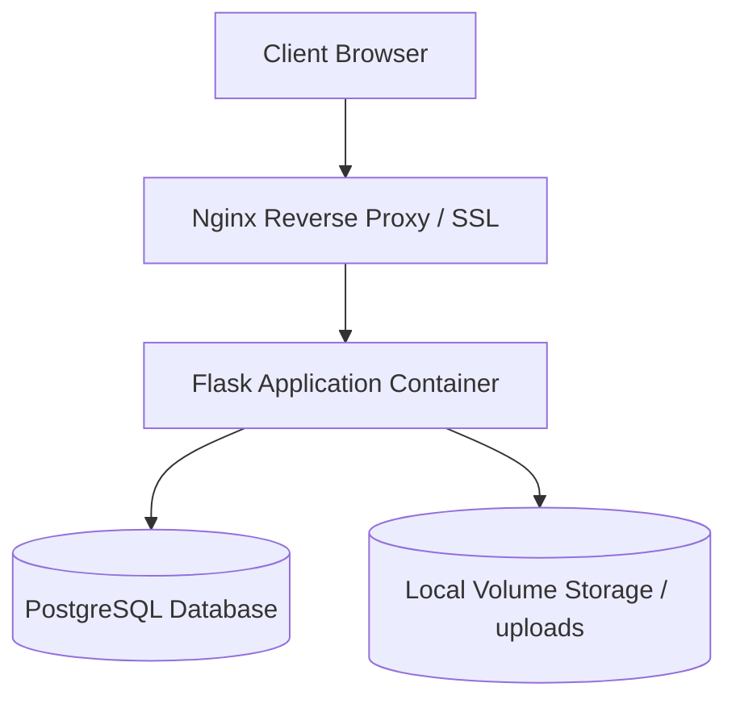

# Disaster Recovery (DR) & Business Continuity Plan (BCP)

This document provides incident response workflows, recovery objectives, restoration procedures, and continuity guidelines for Ranga Farms application infrastructure.

## 1. Recovery Objectives

* **Recovery Point Objective (RPO)**: 24 Hours (Maximum allowable data loss window).
* **Recovery Time Objective (RTO)**: 4 Hours (Maximum allowable duration to restore operations).

---

## 2. Infrastructure & Service Dependencies



* **Core Services**:
  * PostgreSQL (Port 5432)
  * Flask App (Port 5001)
  * Nginx Reverse Proxy (Port 443)

---

## 3. Disaster Recovery Procedures

### A. Secret Recovery Process
In the event of a total server rebuild, retrieve these configuration values from your offsite password manager (e.g. 1Password / Vault):
1. `DB_ENCRYPTION_KEY` (Column-level encryption key)
2. `BACKUP_ENCRYPTION_PASSPHRASE` (GPG backup decryption key)
3. `SECRET_KEY` (Flask session signing key)
4. Database Credentials (`DB_USER`, `DB_PASSWORD`)

### B. Database & File Restoration Process
1. Locate the latest encrypted backup archive:
   ```bash
   ls -la /var/backups/ranga_farm/backup_*.tar.gz.gpg
   ```
2. Decrypt the archive using GPG and the passphrase:
   ```bash
   gpg --decrypt --batch --passphrase "$BACKUP_ENCRYPTION_PASSPHRASE" \
       -o /tmp/decrypted_backup.tar.gz /var/backups/ranga_farm/backup_YYYYMMDDHHMMSS.tar.gz.gpg
   ```
3. Extract the tarball:
   ```bash
   mkdir -p /tmp/extracted_backup
   tar -xzf /tmp/decrypted_backup.tar.gz -C /tmp/extracted_backup
   ```
4. Restore the PostgreSQL database:
   ```bash
   pg_restore -h "$DB_HOST" -U "$DB_USER" -d "$DB_NAME" -c /tmp/extracted_backup/db_dump.sql
   ```
5. Restore media uploads:
   ```bash
   cp -r /tmp/extracted_backup/uploads/* /app/static/uploads/
   ```
6. Verify file ownership:
   ```bash
   chown -R appuser:appgroup /app/static/uploads
   ```

### C. Server Rebuild & Deployment Process
1. Spin up a new Linux instance (Ubuntu LTS recommended).
2. Configure UFW rules by executing [setup_firewall.sh](file:///c:/Users/Suressvar/OneDrive/Documents/GitHub/Final-Ranga-Web-Project/Final-Ranga-Web-Project/setup_firewall.sh).
3. Apply kernel security hardening parameters from [sysctl.conf](file:///c:/Users/Suressvar/OneDrive/Documents/GitHub/Final-Ranga-Web-Project/Final-Ranga-Web-Project/sysctl.conf).
4. Install Docker and Docker Compose:
   ```bash
   apt-get update && apt-get install -y docker.io docker-compose
   ```
5. Deploy application using Docker Compose:
   ```bash
   docker-compose up -d --build
   ```

---

## 4. Disaster Simulation & BCP Incident Response

| Scenario | Detection Method | Containment & Recovery | Residual Risk |
| :--- | :--- | :--- | :--- |
| **Ransomware / Encryption** | Integrity checks fail / Files unreadable | Format server, deploy new OS, restore from GPG-encrypted offsite backups. | Max 24 hours of data loss (RPO). |
| **Server Compromise** | Runtime monitoring logs unexpected processes | Terminate server immediately, audit logging files, deploy fresh server and rotate credentials. | Leaked logs or session tokens. |
| **Accidental Deletion** | App errors / missing media elements | Extract latest decrypted daily backup package and restore folders. | Minor transaction lag. |
| **Cloud Zone Outage** | Health check status endpoint times out | Re-route traffic via DNS failover to standby replica zone. | DNS propagation lag. |

---

## 5. Escalation Contacts & Communications

In the event of a severe outage:
1. **Infrastructure Lead**: Sree (sree@rangafarms.com) - P1 Incident Commander.
2. **Operations Team**: ops@rangafarms.com.
3. **Emergency Alert Channel**: Slack #ops-critical.
